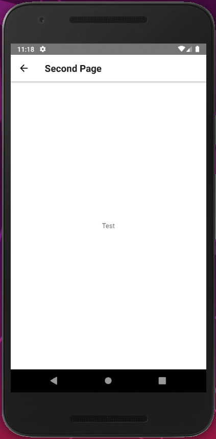

# LightMap: React Native Template Project

Template project for React Native apps.

Features:
* Stack navigation for main App.
* Switch navigation for login screen.
* Button and TextInput components.
* Simple index and second page.

## Screenshots




## Project format

```
App.js                      defines main App
navigators/
    RootNavigator.js        defines routers for app and login
components/
    Button.js               defines Button component
    ...
pages/
    LoginPage.js            login page component
    IndexPage.js            index page component
android/
    ...                     Android specific files
ios/
    ...                     iOS specific files
```

## Usage

```
$ npm install
$ npm run android/web
```

Aggelos Kolaitis <neoaggelos@gmail.com>
